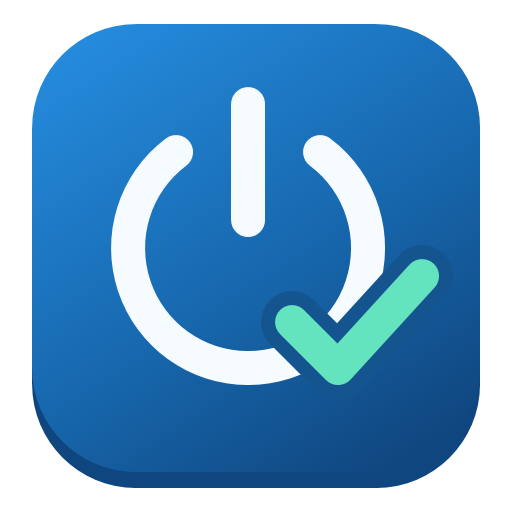

<p align="center">
  
</p>

<h1 align="center">下班关机（After Work Shutdown）</h1>

Windows 11 下班提醒工具：确认手机打卡后，启动可取消的关机倒计时，并提醒关机后拔掉电源插头。按需运行，关闭窗口即退出，无后台服务或开机启动项。

## 构建

需要 Windows PowerShell 5.1 和 .NET Framework 自带的 C# 编译器，无第三方依赖。

```powershell
powershell.exe -NoProfile -ExecutionPolicy Bypass -File .\build.ps1
```

生成文件位于 `build/after-work-shutdown.exe`。

## 使用

1. 运行 `build/after-work-shutdown.exe`。
2. 在手机 App 完成下班打卡，勾选窗口中的确认选项。
3. 保存文件，点击“已打卡，准备关机”。10 秒内可通过取消按钮、Esc 或关闭窗口取消操作。
4. 等电脑完全关机后，再拔掉电源插头。

预览完整流程，不执行关机：

```powershell
& '.\build\after-work-shutdown.exe' --preview
```

可为程序创建快捷方式作为下班关机入口。直接使用 Windows 原有的关机按钮不会触发提醒。程序不读取手机打卡状态，也不检测电源插头；系统更新期间应等待关机完成后再断电。

## 开发

- `src/Program.cs`：程序入口与预览参数。
- `src/ReminderForm.cs`：确认流程、倒计时与窗口交互。
- `src/WindowsShutdown.cs`：Windows 关机接口。
- `tests/ReminderTests.cs`：确认、取消、预览及错误恢复测试。

倒计时由窗口管理，结束后调用 `shutdown.exe /s /t 0`。不使用系统倒计时，因为 `/t` 大于零会隐含 `/f`。[Windows 关机命令文档](https://learn.microsoft.com/en-us/windows-server/administration/windows-commands/shutdown)

## 图标

白色电源符号与青绿色完成勾表示“打卡完成后关机”。图标包含透明背景和 16–256 像素的 15 种尺寸，适配 Windows 11 常用缩放比例；已嵌入 EXE 和程序窗口，运行时无需外部图标文件。

`assets/app-icon.xaml` 是矢量源文件，`app-icon.ico` 用于构建，`app-icon.png` 用于文档预览。修改矢量源文件后，运行以下命令生成资源，再重新构建程序：

```powershell
powershell.exe -NoProfile -STA -ExecutionPolicy Bypass -File .\tools\Build-Icon.ps1
```

## 测试

在 Windows 桌面会话中运行：

```powershell
powershell.exe -NoProfile -ExecutionPolicy Bypass -File .\build.ps1 -Test
```

测试使用模拟关机操作，不会关闭电脑，也不替代实际关机验证。构建与测试产物统一写入 `build/`。

## 许可证

[MIT](LICENSE)
